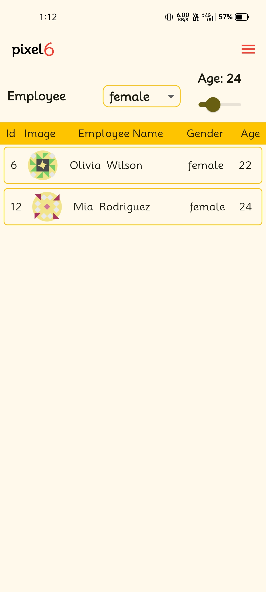

# Employee Details App

# Overview
This Flutter project fetches employee details from an internet API and displays them through an interactive user interface. The app includes filtering features to enhance the user experience, such as gender-wise and age-wise filters. The age filter allows users to select any desired age range using the Flutter Slider widget.


## Features

- **Fetch Data from API:** The app makes network requests to retrieve employee details from an internet API.
Interactive User Interface: Displays employee details in a user-friendly manner.
- **Filtering Options:**
  - **Gender-wise Filtering:** Easily filter employees based on gender.
  - **Age Filtering:** Select any desired age range using the Flutter Slider widget.

## Screenshots
<div style=align-items: center;>
  
  
  
  
</div>

## Installation

1. **Clone the Repository**
   ```bash
   git clone https://github.com/Ankush1200/employee_details.git

2. **Install dependencies**
   ```bash
   flutter pub get
3. **Run the app**
   ```bash
   flutter run

## Contribution
Contributions are welcome! Please fork this repository and submit a pull request for any feature enhancements or bug fixes.

## Contact
- **Email**: ankush78607@gmail.com.
- **GitHub**: https://github.com/Ankush1200.